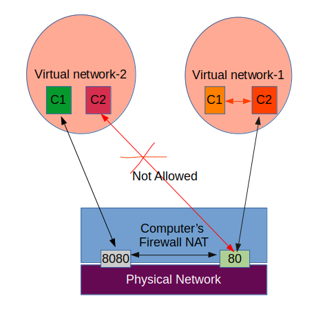

# Containers & Network

## Image Vs Container

- An **Image** is the ***application*** we want to run

- A **container** is an ***instance of that image*** running as a process

  :bell: We can have many containers running off the same image

  :bell: Docker's default image "registry" is called Docker Hub

### Get version and info

:octopus:  Get docker version

```bash
docker version
```

:octopus: Get more information on docker client and server

```bash
docker info
```


### Run a container

#### What happens in 'docker container run'

- Looks for that image locally in image cache, doesn't find any then
- Then looks in remote image repo (default to Docker Hub)
- Downloads the latest version (if version not specified)
- Creates new container based on the image and prepares to start
- Gives it a virtual IP on a private network inside docker engine
- Open up port 80 on host and forwards to port 80 in container
- Starts container by using the CMD in the image Dockerfile

We can change majority of command (CMD) in the image using command line 


:octopus: Run new instance of container

```bash
docker container run -p 80:80 nginx
```

- First, downloaded image 'nginx ' from Docker Hub
- Started a new container from the image
- Opened port 80 on the host IP 
- Routes that traffic to the container IP, port 80 
- The port mapping is of the format  **HOST : CONTAINER**

:octopus: 

```bash
docker container run -p 80:80 --detach nginx
```

- Same as above, but detaches from the terminal
- Each time we run the docker run command we create a new instance of the container. The name of the containers need to be unique, if not its automatically generated for us. This names are usually picked from open source web.

:octopus: Run a container instance

```bash
docker container run --publish 80:80 --detach --name <unique name of your choice> nginx
```


### List all containers, view logs, list processes running with-in a container

#### Are Containers a Mini VM ?

Absoultely No, Containers are not VM they are just a process. Just to show this, start a container using **docker container run** . Then check its PID using **docker top** command. The use **ps** command. We see container is actually a process running on the host. 

```bash
docker container run --name mongo -d mongo
```

```bash
docker ps # list the container running
docker top mongo # lists the processes with in container
```

```bash
ps aux | grep mongo # we can see mongo and its PID on the host
```

​	When we use **docker stop mongo** we stop the process running on local host 

- In a nutshell, containers are just a process running on our host.

  

:octopus:  List all containers 

```bash
docker container ps -a
```

:octopus: Look for logs from running container

```bash
docker container logs <name of the container>
```

:octopus: List all Processes with in a running container

```bash
docker container top <name of the container> 	
```

### Stop and remove containers

:octopus: Remove container

```bash
docker container rm <first 3 characters of container id>
```

- You can use docker rm command to remove multiple containers. Example If we have 3 containers with first character of container ID as 

  63f, 690, 0de . then use below command to remove all of them.

  ```bash
  docker container rm 63f 690 0de
  ```

:octopus: To force remove running container

```bash
docker container rm -f <container id>
```

:octopus: Stop the container

```bash
docker stop <container name>
```


### Getting Stats and inpecting metadata of a container

:octopus: To look into metadata configuration used while setup (does not contain information related to run-time stats)

```bash
docker container inspect <container-name>	
```

:octopus: To look into stats on running container 

```bash
docker container stats <container-name>
```

:octopus: To list stats about all running containers

```bash
docker container stats 
```


### Open a CLI terminal in docker

:octopus:  CLI for container as command

```bash
docker container run -it --name <your_choice> <image_name> bash
```

- Here **-it** is two commands

  - "**i**"  interactive
  - "**t**" psuedo tty

- **bash** is shell program( we could also use **sh** as well), this is a command that is passed to the image. Thus opening the shell.​​ To get out of the shell, just type "exit". Then container stops when command stops. That because container will be alive until command is executing. The moment command stops, container also stops.

- Its important, the image needs to have bash in it to run bash as command. If not we get error saying Program not found in $PATH

  Example: alpine image does not contain bash.

:octopus: Seeing the shell inside running container (only running containers)

```bash
docker container exec -it <container-name> bash
```

- This command is useful in running bash on running container
- This command will not affect the running root container, instead creates additional process on existing container for bash. Once we hit "exit" in bash, this additional container is destroyed. But the root container still runs. 


### Docker Networks

- Docker network works by default
- Each container connected to a private virtual network "bridge" network
- Each virtual network routes through NAT firewall on host IP
- All containers on a virtual network can talk to each other without -p
- Best practice is to create a new virtual network for each app:
  - network "my_web_app" for mysql and php/apache containers
  - network "my_api " for mongo and nodejs containers
- Attach containers to more then one virtual network (or none)
- Skip virtual networks and use host IP (--net=host)
- Use different Docker network drivers to gain new abilities


Docker allows creation of multiple virtual network within a host. Docker container communicates to outside world using  host computer ports through the NAT firewall. Also two virtual network can talk to each other using the same. Thus option -p is required. 

On other hand, containers within the same networks can talk to each other, without the need of sending the traffic to host computers NAT Firewall interface. Thus option -p is not required here.

It must be noted that no two containers can use same port from host computer. As for any application to bind to the port, it needs to be available. Once binded, then port is remains unavailable for other application, until its released by the binding application. This is general limitation from network itself, not docker.

By default docker provide virtual network name "bridge" or "docker 0"



- All externally exposed ports closed by default
- We must manually expose ports via -p, which is better default security


:octopus:  Network port mapping between host and container

```bash
docker container run -p 80:80 --name <container-name> -d nginx
```

- ​	-p option uses format HOST : CONTAINER

  

:octopus: Checking network mapping

```bash
docker container port <container-name>
```


:octopus:  Getting IP address of the container running

```
docker container inspect --format '{{ .NetworkSettings.IPAddress }}' <container-name>
```

:octopus: List all the network

```bash
docker network ls
```

- Docker uses default network driver called 'bridge'. We can change network driver with any third party driver as well. A network driver is
- when we do **network ls** we see 2 types of drivers 
  -  **--network bridge** : This is default docker provided network driver. By default name of the virtual network is also "bridge" (which uses bridge driver) which is NAT'ed behind the host IP. "bridge" network comes with default security.
  - **--network host** : This is special network driver, that skips virtual network of docker to gain performance, but sacrifices security of the container model.
  - **--network none**: This mean no network driver. This removes etho and only leaves with localhost interface in container​

:octopus: Creating a network with default "bridge" network driver

```bash
docker network create <name-of-network>
```

:octopus: Creating a network with other driver than default "bridge" network driver

```bash
docker network create <name-of-network> --driver <driver-name>
```

:octopus:  Creating a network while creating container

```bash
docker container run -d --name <container-name> --network <network-name> <image-name>
```

:octopus: Connecting a container to already existing network

```bash
docker network connect <network-id> <container-id>
```

- We can connect container to multiple network, just like we can connect with ethernet and wifi.

:octopus: Disconnecting a container

```bash
docker network disconnect <network-id> <container-id>
```

### Docker DNS

My default within a virtual network containers can talk to each other using respective container-name. So docker by default provide DNS resolution within the network. The rationale for using container name, is we might not how long container will be live, or what IP they might have (based on order of their start). But on other hand container name won't change.

There is one disadvantage of default "bridge" network, that DNS server is not built by default. Thus we have to link using --link option manually. Instead of this we can create new network, which will have DNS server built for resolving.

:bell: Nutshell

Never rely on IP's for inter-communication, instead use container-names

By default "bridge" network don't have DNS server built in and need to manually link other communication for inter-communication using --link option. On other hand, newly created network will have DNS server for DNS resolution, and hence good idea to create new network and use it.

#### What's the difference between --net-alias and --link

There are two differences between `--net-alias` and `--link`:

1. With `--net-alias`, one container can access the other container only if they are on the same network. In other words, in addition to `--net-alias foo` and `--net-alias bar`, you need to start both containers with `--net foobar_net` after creating the network with `docker network create foobar_net`.
2. With `--net-alias foo`, **all** containers in the same network can reach the container by using its alias `foo`. With `--link`, **only the linked container** can reach the container by using the name `foo`.

## Reference 

:bell:  doc.docker.com and --help 

## Good to knows

:bell:  Some note on Commands

There two version commands old way and new way is using management commands. Both are valid as docker keeps backward compatibility.

Old way:

```bash
docker <command> (options)
```

New way

```bash
docker <command> <sub-command> (options)
```

## Assignment-1

#### Run containers

1. Run a nginx, a mysql, a httpd (apache) server
2. Run all of them --detach, name them with --name
3. nginx should listen on 80:80, httpd on 8080:80, mysql on 3306:3306
4. when sunning mysql, use the --env option(-e) to pass in MYSQL_RANDOM_ROOT_PASSWORD=yes
5. Use docker container logs on mysql to find the random password it created on startup
6. Clean it all with docker container stop and docker container rm (both can accept multiple names and ID's)
7. Use docker container ls to ensure everything is correct before and after cleanup

#### Solution-1

- nginx should listen on 80:80, httpd on 8080:80, mysql on 3306:3306
- when sunning mysql, use the --env option(-e) to pass in MYSQL_RANDOM_ROOT_PASSWORD=yes

```bash
docker container run --publish 80:80 -d --name karsh_nginx nginx

docker container run --publish 8080:80 -d --name karsh_httpd httpd

docker container run --publish 3306:3306 -d -e MYSQL_RANDOM_ROOT_PASSWORD=yes --name karsh_mysql mysql
```

- Use docker container logs on mysql to find the random password it created on startup
- Clean it all with docker container stop and docker container rm (both can accept multiple names and ID's)
- Use docker container ls to ensure everything is correct before and after cleanup

```bash
docker ps -a
docker container logs karsh_mysql
docker container stop ce3 53b f8d
docker container rm ce3 53b f8d 
docker ps -a
```

## Assignment-2 

#### CLI-APP Testing

1. Use different Linux distro containers to check curl cli tool version

2. Use two different terminal windows to start bash in both centos:7 and ubuntu:14.04, using -it

3. Learn the docker container --rm option so we can save cleanup

4. Ensure curl is installed and on latest version for that distro

   - Ubuntu: apt-get update && apt-get install curl

   - centos: yum update curl

5. Check curl --version

#### Solution-2

Use two different terminal windows to start bash in both centos:7 and ubuntu:14.04, using -it and dowload curl and check version

```bash
docker container run -d --rm --name ubuntu ubuntu
docker container run -d --rm --name centos centos
```

- **--rm** option help to removes container when exists. 

```bash
docker container stop <ubuntu-container-id> 
docker container stop <centos-container-id>
```

```bash
docker container run -it centos bash

# centos terminal opens
yum install curl

curl --version
```

```bash
docker container run -it ubuntu bash

# ubuntu terminal opens
apt update
apt-get install curl

curl -version
```

## Assignment-3 

#### DNS Round Robin test

DNA Round robin is a stratergy where muliplt IP addresses can be associated with same DNS name.

- Create a new virtual network (default bridge driver)
- Create two containers (elasticsearch server) from elasticsearch:2 image  
- Research and use --network-alias search when creating them to give them an additional DNS name to respond to
- Run alpine nslookup search with --net to see the two containers list for the same DNS name
- Run centos curl -s serach:9200 with --net multiple times until you see both "name" fields show

Solution-3

```bash
# create a new virtual network
docker network create kar

# create elasticsearch server on container 1 of alpine image with network alias search

docker container run -d --net kar --network-alias search elasticsearch:2

# create elasticsearch server on container 2 of alpine image with network alias search
docker container run -d --net kar --network-alias search elasticsearch:2

# check if both container are there
docker container ls

# run a test using 3rd container to check ip address of the container 1 and 2
docker container run --rm --net kar alpine nslookup search

# now using centos container curl for elasticsearch server over the network. Here any one of the server must respond.
docker container run --rm --net kar centos curl -s search:9200
```

